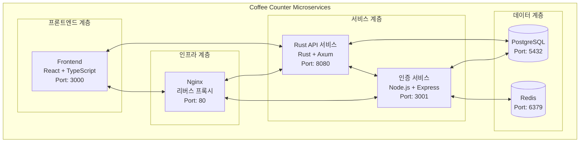
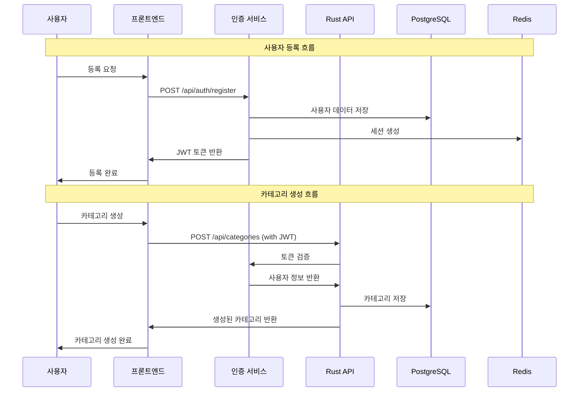
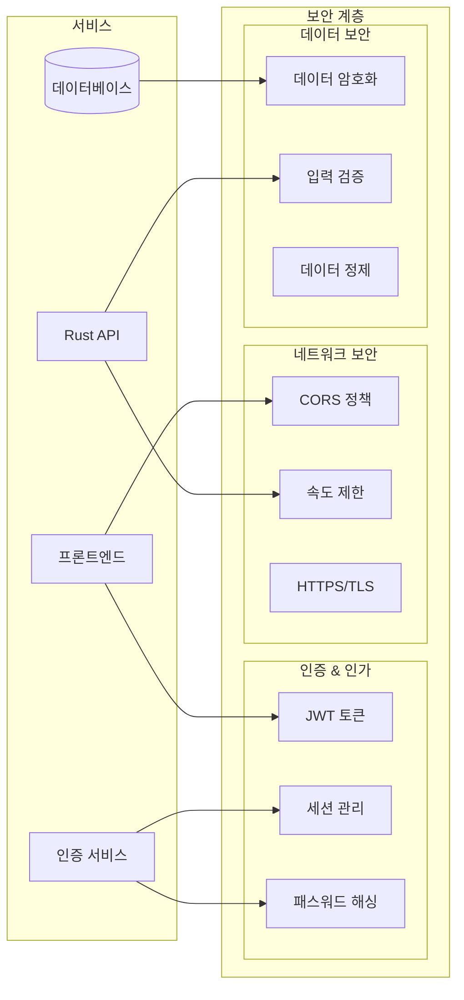
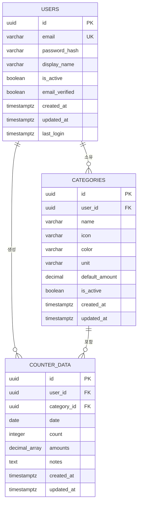
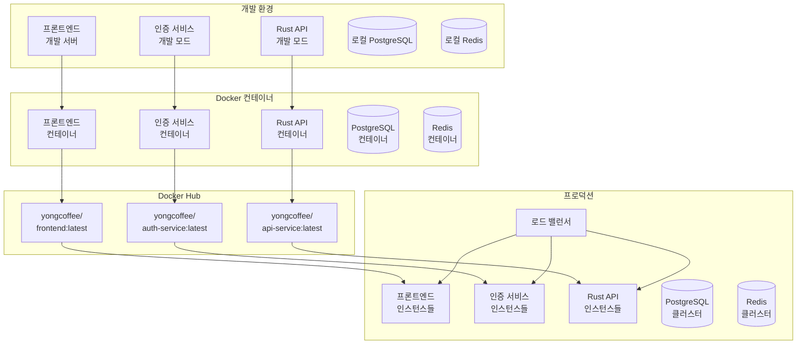
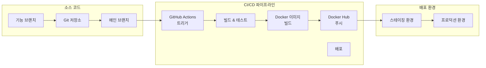
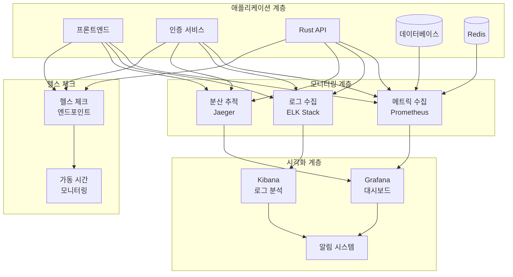
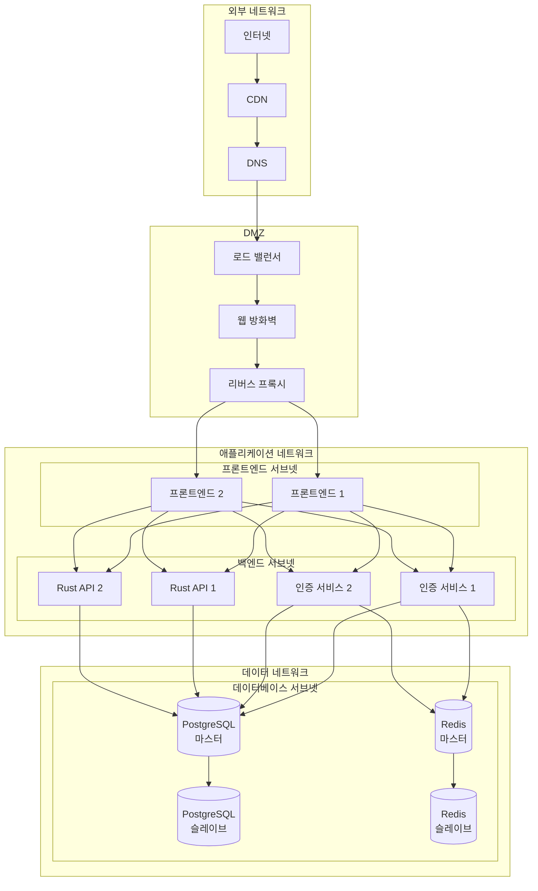
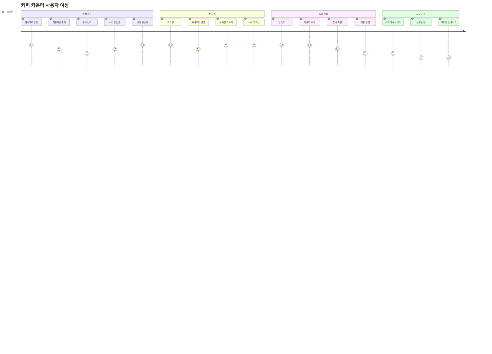

# 🎨 Mermaid 아키텍처 다이어그램

Coffee Counter Microservices의 시각적 아키텍처 다이어그램 모음입니다.

## 🏗️ 시스템 아키텍처 다이어그램

## 🔄 데이터 흐름 다이어그램

## 🔐 보안 아키텍처 다이어그램

## 📊 데이터베이스 ERD

## 🚀 배포 아키텍처 다이어그램

## 🔄 CI/CD 파이프라인 다이어그램

## 📈 모니터링 아키텍처 다이어그램

## 🌐 네트워크 아키텍처 다이어그램

## 📱 사용자 여정 다이어그램

---

**이 다이어그램들은 시스템의 다양한 측면을 시각적으로 표현합니다.**
